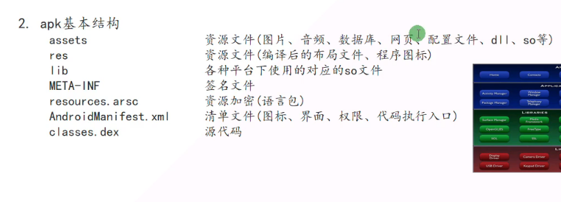
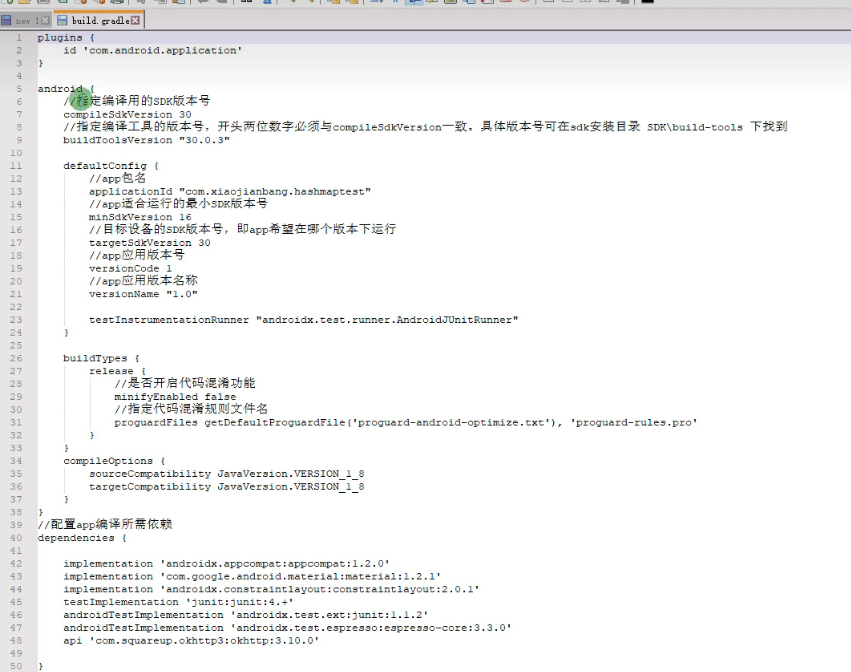
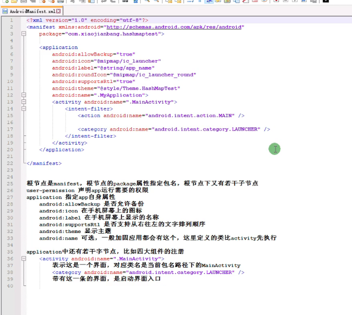

### Build.gradle



### AndroidManifest.xml 介绍

 3. 时间执行顺序
Application attachBaseContext
Application onCreate
MainActivity attachBaseContext
MainActivity onCreate

4. Application 的生命周期很长，可以用来传递一些全局变量

```Java
public static HashMap<String, String> mInfoMap = new HashMap<>();
```

定义静态变量，别的类中直接通过类名访问
