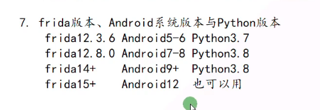

## 安装 Python3.8

安装 Python3.8 64bit 任意一个版本都可以
[Python](https://www.python.org/downloads)

## 安装 Frida

pip install frida==14.2.18
pip install frida-tools==9.2.5

### 如何判断 frida 是否安装成功

- cmd 中执行 frida --version
- cmd 中执行 python，进入控制台 import frida，能导包成功说明没问题



## Frida 代码提示

npm i @types/frida-gum

## Frida Server

[Frida Server 指定版本下载](https://github.com/frida/frida/releases/tag/14.2.18)

- 通过 usb 连真机不需要转发端口，通过 ip 连接需要转发，连模拟器也需要转发

  > adb forward tcp:27042 tcp:27042

- push frida server package to your phone

```cmd

C:\Users\Fawei>adb push F:\dev-software\android\frida\frida-server-14.2.18-android-arm64 /data/local/tmp/fsarm64
```

- CD to target folder

```
C:\Users\Fawei>adb shell
sailfish:/ $ su
sailfish:/ # cd data/local/tmp/fsarm64
/system/bin/sh: cd: /data/local/tmp/fsarm64: Not a directory
2|sailfish:/ # cd data/local/tmp
sailfish:/data/local/tmp # ls
fsarm64 lldb-server start_lldb_server.sh
sailfish:/data/local/tmp #
```

- 修改权限

```
sailfish:/data/local/tmp # chmod 777 fsarm64
```

- 运行 Frida Server

```
./fsarm64
```
