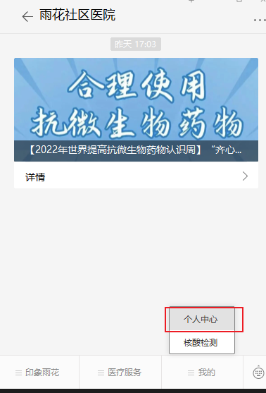
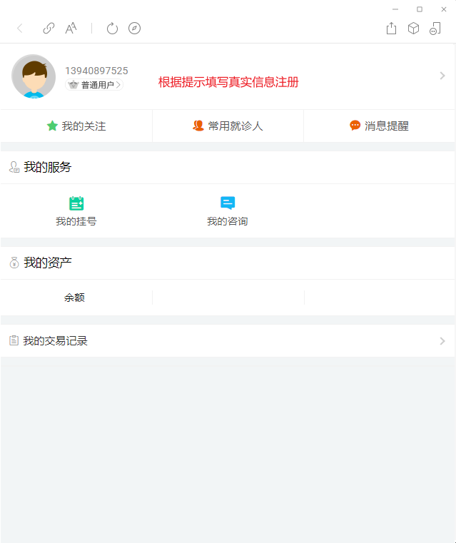
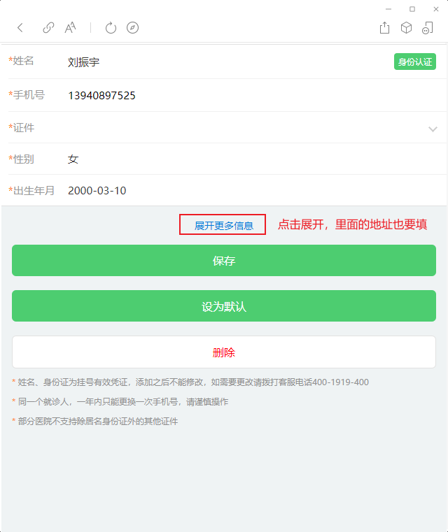
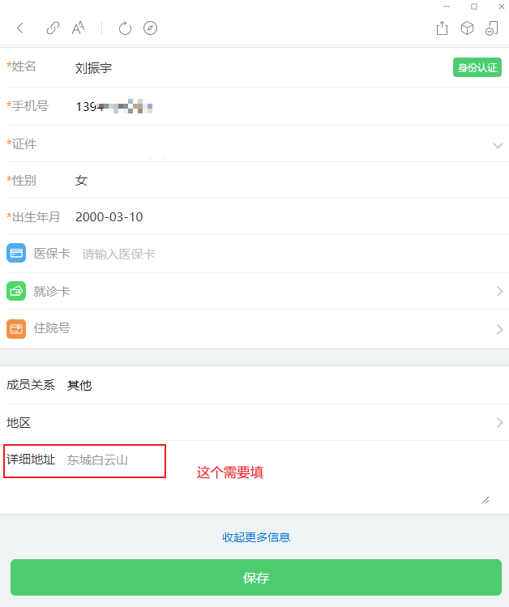

## 雨花社区医院

1. 关注雨花社区医院公众号
   

2. 进入公众号点右下角【我的】 - 【个人中心】
   
3. 根据提示注册预约平台账号
4. 点击常用就诊人并添加就诊人 （所有信息都要填，包括地址）
   
   

## 包河区包公街道

1. 关注公众号【包河区包公街道社区卫生服务中心】
2. 进入公众号点击右下角【公共卫生】-【个人中心】
3. 根据提示注册预约平台账号
   4-1. 点击常用就诊人添加就诊人
   4-2. 除了必须项目外，还要点击【更多信息】并填写成员关系（本人）和地址

## 南京流程

1. 关注公众号【雨花社区医院】
2. 进入公众号点击右下角【我的】-【个人中心】
3. 根据提示注册预约平台账号
   4-1. 点击常用就诊人添加就诊人
   4-2. 除了必须项目外，还要点击【更多信息】并填写成员关系（本人）和地址

## 南京雨花经开区流程

1. 关注公众号【雨花经济开发区社区卫生服务中心】
2. 进入公众号点击下放【医院概况】-【个人中心】
3. 点击【头像】注册预约平台账号
   3-1. 点击常用就诊人添加就诊人
   3-2. 除了必须项目外，还要点击【更多信息】并填写成员关系（本人）和地址
4. 微信扫码
5. 周五 7 点 53 分会收到【健康之路】的短信验证码，请发给联系人
   验证码格式：手机号 - 验证码

## 蜀山井岗

1. 关注公众号【蜀山区井岗中心服务号】
2. 进入公众号点击左下角【预约挂号】-【个人中心】
3. 根据提示注册预约平台账号
   4-1. 点击常用就诊人添加就诊人
   4-2. 除了必须项目外，还要点击【更多信息】并填写成员关系（本人）和地址
4. 微信扫码
5. 7 点 55 分左右注意【健康之路】发来的短信验证码

## 包河区包公

1. 关注公众号【包河区包公街道社区卫生服务中心】
2. 进入公众号点击右下角【公共卫生】-【个人中心】
3. 点击【头像】注册预约平台账号
   4-1. 点击常用就诊人添加就诊人
   4-2. 除了必须项目外，还要点击【更多信息】并填写成员关系（本人）和地址
4. 微信扫码
5. 预约开始前 7 分钟左右注意【健康之路】发来的短信验证码
